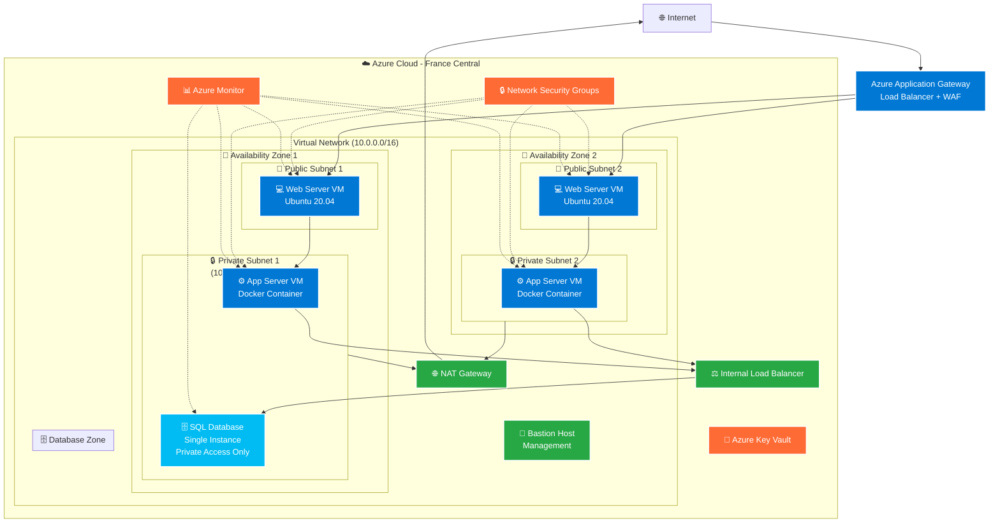
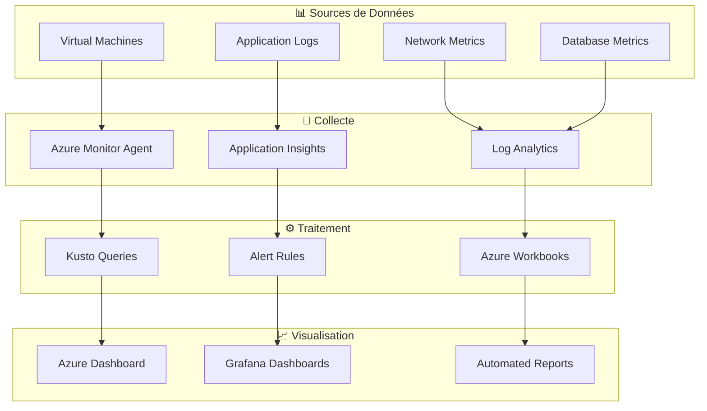

# 🌟 The Ultimate Beginner Cloud Project

> **Un projet complet d'apprentissage du Cloud Computing avec Azure, Docker, et DevOps**

Ce projet illustre une architecture cloud moderne et sécurisée déployée sur Microsoft Azure. Il s'agit d'une application web de messagerie développée en PHP/MySQL, containerisée avec Docker et déployée sur une infrastructure haute disponibilité multi-zones.


## 📋 Table des Matières

1. [Vue d'Ensemble](#vue-densemble)
2. [Architecture Cloud](#architecture-cloud)
3. [Application Web](#application-web)
4. [Infrastructure as Code](#infrastructure-as-code)
5. [CI/CD et Déploiement](#cicd-et-déploiement)
6. [Sécurité](#sécurité)
7. [Monitoring et Observabilité](#monitoring-et-observabilité)
8. [Guide de Déploiement](#guide-de-déploiement)
9. [Troubleshooting](#troubleshooting)

## 🎯 Vue d'Ensemble

### Objectifs Pédagogiques

Ce projet couvre tous les aspects essentiels du Cloud Computing moderne :

- **☁️ Cloud Native** : Architecture multi-zones sur Microsoft Azure
- **🐳 Containerisation** : Application dockerisée prête pour la production
- **🔄 DevOps** : Pipeline CI/CD automatisé avec GitLab
- **🛡️ Sécurité** : Implémentation des bonnes pratiques de sécurité
- **📊 Monitoring** : Observabilité complète avec Azure Monitor
- **🏗️ IaC** : Infrastructure définie comme code avec Terraform
- **⚙️ Automation** : Déploiement automatisé avec Ansible

### Technologies Utilisées

#### Frontend & Backend
- **PHP 8.1** - Langage de développement principal
- **Apache** - Serveur web intégré au container
- **MySQL/SQL Server** - Base de données relationnelle
- **HTML5/CSS3/JavaScript** - Interface utilisateur moderne

#### Infrastructure & Cloud
- **Microsoft Azure** - Plateforme cloud principale
- **Terraform** - Infrastructure as Code
- **Ansible** - Configuration management et déploiement
- **Docker** - Containerisation

#### DevOps & CI/CD
- **GitLab CI/CD** - Pipeline d'intégration continue
- **Docker Registry** - Registry d'images privé
- **Bash Scripts** - Scripts d'automatisation

## Prérequis

*   Serveur web avec PHP (ex: Apache, Nginx avec PHP-FPM, ou le serveur de développement intégré de PHP)
*   Serveur MySQL

## Installation

1.  **Base de données :**
    *   Assurez-vous que votre serveur MySQL est en cours d'exécution.
    *   Créez une base de données (par exemple, `ma_base_de_donnees`).
    *   Créez un utilisateur MySQL ayant les droits sur cette base de données (ou utilisez l'utilisateur `root` pour des tests locaux UNIQUEMENT).

2.  **Configuration :**
    *   Ouvrez le fichier `includes/db_connect.php`.
    *   Modifiez les constantes `DB_SERVER`, `DB_USERNAME`, `DB_PASSWORD`, et `DB_NAME` avec vos propres informations de connexion à la base de données.

3.  **Création de la table :**
    *   Placez le dossier `php_mysql_app_simple` dans le répertoire racine de votre serveur web (par exemple `htdocs/` pour XAMPP/Apache, `www/` pour WAMP).
    *   Accédez au script `setup_db.php` via votre navigateur : `http://localhost/php_mysql_app_simple/setup_db.php` (adaptez l'URL si nécessaire).
    *   OU exécutez-le en ligne de commande depuis le dossier `php_mysql_app_simple` : `php setup_db.php`
    *   Cela créera la table `messages` dans votre base de données. Vous n'avez besoin de le faire qu'une seule fois.
    *   **Après avoir exécuté `setup_db.php`**, vous devrez **ajouter manuellement quelques lignes de données** dans la table `messages` (par exemple via phpMyAdmin ou un client SQL) pour avoir quelque chose à afficher.
    *   **Optionnel mais recommandé :** Supprimez ou déplacez `setup_db.php` après l'exécution pour des raisons de sécurité.

4.  **Lancement de l'application :**
    *   Accédez à `public/index.php` via votre navigateur : `http://localhost/php_mysql_app_simple/public/` ou `http://localhost/php_mysql_app_simple/public/index.php`.

## 🏗️ Architecture Cloud

### Diagramme d'Infrastructure



### Composants de l'Infrastructure

#### Réseau et Sécurité
- **Virtual Network (VNet)** : Réseau privé isolé dans Azure
- **Subnets** : Segmentation en sous-réseaux publics et privés
- **NAT Gateway** : Accès Internet sortant sécurisé pour les subnets privés
- **Network Security Groups** : Pare-feu au niveau des sous-réseaux
- **Azure Key Vault** : Gestion sécurisée des secrets et certificats

#### Load Balancing et High Availability
- **Application Gateway** : Load balancer Layer 7 avec WAF intégré
- **Internal Load Balancer** : Répartition de charge pour les bases de données
- **Multi-Zone Deployment** : Répartition sur 2 zones de disponibilité

#### Compute et Storage
- **Virtual Machines** : Instances Ubuntu 20.04 LTS optimisées
- **Managed Disks** : Stockage persistant haute performance
- **Container Registry** : Registry privé pour les images Docker

## 💻 Application Web

### Architecture Applicative

L'application suit une architecture 3-tiers moderne :

```
┌─────────────────┐    ┌─────────────────┐    ┌─────────────────┐
│   Presentation  │    │    Business     │    │      Data       │
│      Layer      │    │     Logic       │    │     Layer       │
├─────────────────┤    ├─────────────────┤    ├─────────────────┤
│ • HTML/CSS/JS   │◄───┤ • PHP 8.1       │◄───┤ • MySQL/MSSQL   │
│ • Bootstrap UI  │    │ • Security Mgr  │    │ • Connection    │
│ • AJAX/Fetch    │    │ • Message Mgr   │    │   Pooling       │
│ • Responsive    │    │ • Rate Limiting │    │ • Transactions  │
└─────────────────┘    └─────────────────┘    └─────────────────┘
```

### Fonctionnalités Principales

#### 💬 Système de Messagerie
- **Affichage en temps réel** : Mise à jour automatique des messages
- **Interface moderne** : Design responsive et intuitive
- **Validation côté client** : Contrôles JavaScript avancés
- **API REST** : Endpoints pour l'intégration mobile

#### 🔐 Sécurité Intégrée
- **Protection CSRF** : Tokens anti-forgery sur tous les formulaires
- **Prévention XSS** : Échappement HTML systématique
- **Injection SQL** : Requêtes préparées exclusivement
- **Rate Limiting** : Protection contre le spam et les attaques

#### 📱 Expérience Utilisateur
- **Progressive Web App** : Fonctionnalités offline
- **Notifications** : Système de toast notifications
- **Thème adaptatif** : Support du mode sombre
- **Accessibilité** : Conformité WCAG 2.1

### Structure du Code

```
app/
├── src/
│   ├── public/               # Point d'entrée web
│   │   ├── index.php        # Page principale
│   │   ├── api.php          # API REST
│   │   └── style.css        # Styles CSS
│   ├── includes/            # Classes métier
│   │   ├── db_connect.php   # Connexion BDD
│   │   ├── message_manager.php # Gestion messages
│   │   ├── security.php     # Gestionnaire sécurité
│   │   └── security_config.php # Configuration
│   ├── SECURITY.md          # Documentation sécurité
│   └── setup_db.php         # Script d'initialisation
├── compose.yaml             # Configuration Docker Compose
└── Dockerfile              # Image Docker personnalisée
```

## 🏗️ Infrastructure as Code

### Terraform - Provisioning d'Infrastructure

Le projet utilise Terraform pour définir l'infrastructure de manière déclarative :

```hcl
# Structure des fichiers Terraform
infra/terraform/
├── main.tf              # Configuration principale
├── variables.tf         # Variables d'entrée
├── outputs.tf          # Valeurs de sortie
├── terraform.tfvars    # Valeurs des variables
└── versions.tf         # Versions des providers
```

#### Ressources Provisionnées

**Réseau et Sécurité :**
- Virtual Network avec 4 sous-réseaux
- Network Security Groups avec règles optimisées
- NAT Gateway pour l'accès Internet sécurisé
- Azure Bastion pour l'administration

**Compute et Storage :**
- Virtual Machines Ubuntu 20.04 dans chaque zone
- Managed Disks avec chiffrement
- Availability Sets pour la haute disponibilité

**Load Balancing :**
- Application Gateway avec WAF
- Load Balancer interne pour les bases de données

### Ansible - Configuration Management

Ansible automatise la configuration des serveurs :

```yaml
# Structure des playbooks Ansible
infra/ansible/
├── deploy.yml           # Playbook principal
├── inventory.yml        # Inventaire des serveurs
├── ansible.cfg         # Configuration Ansible
├── requirements.txt    # Dépendances Python
└── deploy.sh          # Script de lancement
```

#### Tâches Automatisées

1. **Préparation Système :**
   - Mise à jour des paquets Ubuntu
   - Installation de Docker et Docker Compose
   - Configuration des utilisateurs et permissions

2. **Déploiement Application :**
   - Téléchargement des images Docker
   - Configuration des variables d'environnement
   - Démarrage des services

3. **Monitoring et Logging :**
   - Installation des agents Azure Monitor
   - Configuration des logs centralisés
   - Health checks automatiques

## 🔄 CI/CD et Déploiement

### Pipeline GitLab CI/CD

Le projet implémente un pipeline DevOps complet :

```mermaid
graph LR
    A[📝 Code Commit] --> B[🔍 Tests Unitaires]
    B --> C[🔒 Scan Sécurité]
    C --> D[🐳 Build Docker]
    D --> E[📦 Push Registry]
    E --> F[🚀 Deploy Staging]
    F --> G[✅ Tests E2E]
    G --> H[🌟 Deploy Production]
    
    classDef commit fill:#28a745
    classDef test fill:#17a2b8
    classDef security fill:#dc3545
    classDef build fill:#fd7e14
    classDef deploy fill:#6f42c1
    
    class A commit
    class B,G test
    class C security
    class D,E build
    class F,H deploy
```



### Stratégie de Déploiement

#### Blue-Green Deployment
- **Environment Blue** : Production actuelle
- **Environment Green** : Nouvelle version en test
- **Switch instantané** : Basculement sans interruption

#### Rollback Automatique
- **Health Checks** : Vérification automatique post-déploiement
- **Métriques de Performance** : Monitoring des temps de réponse
- **Rollback Trigger** : Retour automatique en cas d'échec

### Scripts d'Automatisation

```bash
# deploy.sh - Script principal de déploiement
#!/bin/bash

# Variables d'environnement
APP_IMAGE="registry.gitlab.com/cloudproject/app"
BASTION_HOST="40.66.35.42"
PUBLIC_SERVERS=("10.0.1.4" "10.0.1.5")

# Fonctions de déploiement
deploy_to_servers() {
    for server in "${PUBLIC_SERVERS[@]}"; do
        echo "🚀 Déploiement sur $server"
        ssh -J bastion@$BASTION_HOST ubuntu@$server "
            docker pull $APP_IMAGE:latest
            docker-compose down
            docker-compose up -d
        "
    done
}
```

## 🛡️ Sécurité

### Modèle de Sécurité Defense in Depth

Le projet implémente une approche de sécurité multicouche :

```
┌─────────────────────────────────────────────────────────────┐
│                    🌐 Edge Security                         │
│  • WAF Rules  • DDoS Protection  • Geographic Filtering    │
├─────────────────────────────────────────────────────────────┤
│                   🔒 Network Security                       │
│  • NSG Rules  • Private Subnets  • Network Segmentation    │
├─────────────────────────────────────────────────────────────┤
│                  💻 Host Security                           │
│  • OS Hardening  • Updates  • Antimalware                  │
├─────────────────────────────────────────────────────────────┤
│                📱 Application Security                      │
│  • CSRF Protection  • XSS Prevention  • SQL Injection      │
├─────────────────────────────────────────────────────────────┤
│                   🗄️ Data Security                          │
│  • Encryption at Rest  • Encryption in Transit  • Backup   │
└─────────────────────────────────────────────────────────────┘
```

### Mesures de Sécurité Implémentées

#### Au Niveau Application
- **Protection CSRF** : Tokens uniques par session
- **Validation d'Entrée** : Sanitisation de tous les inputs
- **Rate Limiting** : Protection contre les attaques par force brute
- **Session Management** : Gestion sécurisée des sessions utilisateur

#### Au Niveau Infrastructure
- **Network Segmentation** : Isolation des tiers applicatifs
- **Least Privilege** : Principe du moindre privilège
- **Secrets Management** : Azure Key Vault pour les secrets
- **Audit Logging** : Traçabilité complète des actions

### Conformité et Standards

- **OWASP Top 10** : Protection contre les vulnérabilités critiques
- **ISO 27001** : Pratiques de sécurité des systèmes d'information
- **GDPR** : Protection des données personnelles
- **SOC 2** : Contrôles de sécurité organisationnels

## 📊 Monitoring et Observabilité

### Azure Monitor Stack



### Métriques Surveillées

#### Performance Application
- **Temps de Réponse** : Latence des pages web
- **Throughput** : Nombre de requêtes par seconde
- **Taux d'Erreur** : Pourcentage d'erreurs HTTP
- **Saturation** : Utilisation des ressources

#### Infrastructure
- **CPU/RAM** : Utilisation des ressources serveur
- **Réseau** : Bande passante et latence
- **Stockage** : IOPS et latence des disques
- **Disponibilité** : Uptime des services

### Alerting et Notifications

- **Slack Integration** : Notifications en temps réel
- **Email Alerts** : Alertes critiques par email
- **SMS Escalation** : Escalade automatique
- **PagerDuty** : Gestion des incidents 24/7

## 🚀 Guide de Déploiement

### Prérequis

#### Comptes et Accès
```bash
# Azure CLI
az login
az account set --subscription "your-subscription-id"

# Terraform
terraform --version  # >= 1.0
export ARM_SUBSCRIPTION_ID="your-subscription"
export ARM_CLIENT_ID="your-service-principal"
export ARM_CLIENT_SECRET="your-password"
export ARM_TENANT_ID="your-tenant"

# Ansible
pip install ansible azure-cli
ansible --version  # >= 2.9
```

#### Variables d'Environnement
```bash
# Configuration du projet
export PROJECT_NAME="cloudproject"
export ENVIRONMENT="production"
export LOCATION="France Central"
export ADMIN_USERNAME="azureuser"
```

### Déploiement Step-by-Step

#### 1. Provisioning Infrastructure

```bash
# Initialisation Terraform
cd infra/terraform
terraform init
terraform plan -var-file="terraform.tfvars"
terraform apply -auto-approve

# Récupération des outputs
export BASTION_IP=$(terraform output -raw bastion_public_ip)
export WEB_IPS=$(terraform output -json web_server_ips | jq -r '.[]')
```

#### 2. Configuration des Serveurs

```bash
# Déploiement Ansible
cd ../ansible
ansible-playbook -i inventory.yml deploy.yml \
  --extra-vars "bastion_host=$BASTION_IP"

# Vérification du déploiement
ansible all -i inventory.yml -m ping
```

#### 3. Déploiement Application

```bash
# Build et push de l'image Docker
docker build -t $REGISTRY_URL/cloudproject:$BUILD_ID .
docker push $REGISTRY_URL/cloudproject:$BUILD_ID

# Déploiement via script
./deploy.sh $BUILD_ID
```

#### 4. Validation et Tests

```bash
# Tests de connectivité
curl -f http://$WEB_IP/health
curl -f http://$WEB_IP/api/status

# Tests de charge
ab -n 1000 -c 10 http://$WEB_IP/

# Tests de sécurité
nmap -sS $WEB_IP
```

---

*Dernière mise à jour : Juin 2025*
*Version : 2.1.0*